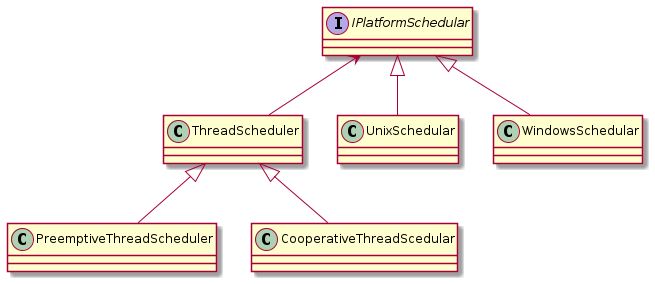

# Bridge Design Pattern

Connecting components together through abstractions

# Motivation

* Brigde prevents a 'Cartesian product' complexity explosion
* Example:
    - Base class ThreadSchedular
    - Can be preemptive or cooperative
    - Can run on Windows or Unix
    - End up with a 2x2 scenario: WindowsPTS, UnixPTS, WindowsCTS, UnixCTS
* Bridge pattern avoids the entity explosion

## Before

You have 4 distinct classes

## After

Less inheritance and aggregation in this way of handling bridging

## Bridge
A mechanism that decouples an interface (hierarchy) from an implementation (hierarchy)

# Summary
* Decouple abstraction from implementation
* Both can exist as hierarchies
* Can think of as a stronger form of encapsulation